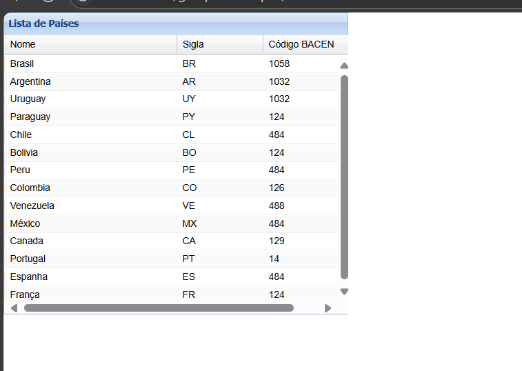
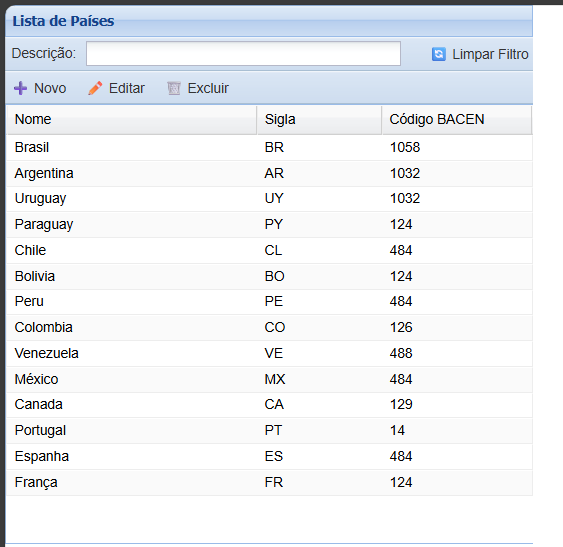

# Práticas com ExtJs

Um sistema de prática e aprendizado do ExtJS 3.4.1, desenvolvido para demonstrar diferentes componentes e funcionalidades da biblioteca.

## Índice

- [Visão Geral](#visão-geral)
- [Estrutura do Projeto](#estrutura-do-projeto)
- [Módulos Disponíveis](#módulos-disponíveis)
- [Formulários Práticos (Form-Tasks)](#formulários-práticos-form-tasks)
- [Tecnologias Utilizadas](#tecnologias-utilizadas)
- [Como Executar](#como-executar)
- [Funcionalidades](#funcionalidades)
- [Screenshots](#screenshots)

## Visão Geral

Este projeto é uma coleção de exemplos práticos do ExtJS 3.4.1, organizados em módulos independentes que demonstram diferentes aspectos da biblioteca. Cada módulo foi desenvolvido para ser um ambiente de aprendizado e prática, permitindo que desenvolvedores explorem os componentes do ExtJS de forma interativa.

## Estrutura do Projeto

```
extjs-project/
├── Telas-ExtJs/              # Módulos principais do ExtJS
│   ├── form-task1/           # Formulário básico com campos simples
│   ├── form-task2/           # Formulário com validações
│   ├── form-task3/           # Formulário com layout column
│   ├── form-task4/           # Formulário com fieldsets
│   ├── formulario/           # Sistema de formulários avançados
│   ├── grid-paises-simples/  # Grid simples de países
│   ├── panel-simples/        # Exemplos de painéis básicos
│   ├── window/               # Sistema de janelas simples
│   ├── window-navigation/    # Janelas com navegação
│   └── xtypes/               # Sistema completo com xtypes
├── grid-paises-editavel/     # Grid editável de países (fora da pasta Telas-ExtJs)
├── PaisesAPI/                # Backend C# API para integração
└── README.md
```

## Módulos Disponíveis

### 1. **Formulário** 
Sistema de formulários com validação, grid interativo e diferentes tipos de campos.

**Características:**
- Grid de usuários com CRUD completo
- Formulários com validação avançada
- Sistema de abas organizado
- Componentes interativos (alert, confirm, prompt)
- Progress bar com animação


### 2. **Xtypes** 
Sistema com layout border, navegação lateral e formulários organizados por categorias.

**Características:**
- Layout border com navegação lateral
- 5 abas organizadas por categoria
- Toolbar com ícones
- Campo de pesquisa funcional
- Formulários com validação específica


### 3. **Window** 
Sistema simples de janelas com abas, demonstrando conceitos básicos do ExtJS.

**Características:**
- Janela modal com abas
- Botão para abrir/fechar
- Conteúdo HTML simples
- Estrutura básica e limpa


### 4. **Window-Navigation** 
Janelas com layout border e navegação lateral, demonstrando layouts mais complexos.

**Características:**
- Layout border com painel lateral
- Sistema de abas no centro
- Painel de navegação colapsível
- Estrutura organizada


### 5. **Grid-Paises-Simples** 
Grid básico que lista países com dados estáticos.

**Características:**
- Grid simples com dados de países
- Colunas: Nome, Sigla, Código BACEN
- Dados estáticos carregados
- Layout limpo e organizado
- Demonstração básica de GridPanel



### 6. **Grid-Paises-Editavel** 
Grid avançado com funcionalidades CRUD completas e integração com API C#.

**Características:**
- Grid com dados de países
- Campo de busca por descrição
- Botões de ação: Novo, Editar, Excluir
- Formulário modal para criar/editar países
- Validação de formulários
- Filtro em tempo real
- Interface moderna com ícones
- **Integração com API C# backend**


.png)
.png)

### 7. **Panel-Simples** 
Exemplos básicos de painéis e componentes simples do ExtJS.

**Características:**
- Painéis básicos
- Componentes simples
- Demonstração de layouts
- Código limpo e direto


## Formulários Práticos (Form-Tasks)

### 8. **Form-Task1** 
Formulário básico com campos simples e layout básico.

**Características:**
- Campos de texto básicos
- Layout simples e direto
- Demonstração de fieldLabel e labelWidth
- Estrutura fundamental do ExtJS


### 9. **Form-Task2** 
Formulário com validações e campos específicos.

**Características:**
- Validações de campos obrigatórios
- Diferentes tipos de campos (text, number, date)
- Layout organizado
- Demonstração de validações


### 10. **Form-Task3** 
Formulário com layout column e organização em colunas.

**Características:**
- Layout column para organizar campos lado a lado
- Campos organizados em linhas
- Demonstração de columnWidth
- Estrutura mais complexa


### 11. **Form-Task4** 
Formulário com fieldsets e organização por seções.

**Características:**
- Fieldsets para organizar campos por categoria
- Layout column com fieldsets
- Campos organizados em grupos lógicos
- Estrutura hierárquica


## Tecnologias Utilizadas

- **ExtJS 3.4.1** - Framework JavaScript principal
- **HTML5** - Estrutura das páginas
- **JavaScript** - Lógica de programação
- **C# .NET 8** - Backend API (para grid-paises-editavel)

## Como Executar

### Pré-requisitos
- Navegador web moderno (Chrome, Firefox, Safari, Edge)
- Servidor web local (opcional, mas recomendado)
- .NET 8 SDK (para executar a API backend)

### Passos para Execução

1. **Clone o repositório:**
   ```bash
   git clone [url-do-repositorio]
   cd extjs-project
   ```

2. **Para módulos básicos (sem backend):**
   - Navegue até a pasta `Telas-ExtJs`
   - Escolha o módulo desejado
   - Abra o arquivo `index.html` no navegador

3. **Para o grid-paises-editavel (com backend):**
   ```bash
   # 1. Inicie a API backend
   cd PaisesAPI/PaisesAPI
   dotnet run
   
   # 2. Em outro terminal, abra o frontend
   open grid-paises-editavel/index.html
   ```

4. **Exemplos de execução:**
   ```bash
   # Para o sistema de formulários avançados
   open Telas-ExtJs/formulario/index.html
   
   # Para o sistema xtypes
   open Telas-ExtJs/xtypes/index.html
   
   # Para grids de países
   open Telas-ExtJs/grid-paises-simples/index.html
   open grid-paises-editavel/index.html  # (com backend)
   
   # Para janelas simples
   open Telas-ExtJs/window/index.html
   
   # Para formulários práticos
   open Telas-ExtJs/form-task1/index.html
   open Telas-ExtJs/form-task2/index.html
   open Telas-ExtJs/form-task3/index.html
   open Telas-ExtJs/form-task4/index.html
   ```

## Funcionalidades

### Componentes Demonstrados

- **GridPanel** - Tabelas interativas com dados
- **FormPanel** - Formulários com validação
- **Window** - Janelas modais e não-modais
- **TabPanel** - Sistema de abas
- **Panel** - Painéis com diferentes layouts
- **Button** - Botões com handlers
- **TextField** - Campos de texto
- **DateField** - Seletores de data
- **NumberField** - Campos numéricos
- **ComboBox** - Caixas de seleção
- **CheckBox** - Caixas de seleção
- **MessageBox** - Diálogos de mensagem
- **ProgressBar** - Barras de progresso
- **FieldSet** - Agrupamento de campos
- **Column Layout** - Layout em colunas

### Validações Implementadas

- **Campos obrigatórios** (`allowBlank: false`)
- **Validação de email** (`vtype: 'email'`)
- **Valores numéricos** (`minValue`, `maxValue`)
- **Máscaras de entrada** (`maskRe`)
- **Formatação de data** (`format: 'd/m/Y'`)

### Layouts Utilizados

- **Border Layout** - Layout com regiões (north, south, east, west, center)
- **Fit Layout** - Layout que se adapta ao container
- **Form Layout** - Layout específico para formulários
- **HBox Layout** - Layout horizontal
- **VBox Layout** - Layout vertical
- **Column Layout** - Layout em colunas com columnWidth
- **Anchor Layout** - Layout com ancoragem percentual

## Screenshots

### Sistema de Formulários


### Sistema XTypes


### Grids de Países


### Janelas Simples


### Janelas com Navegação


### Painéis Simples


### Formulários Práticos


## Autor

Desenvolvido por **Gabriel Barros** para fins de prática do ExtJS 3.4.1.

---
